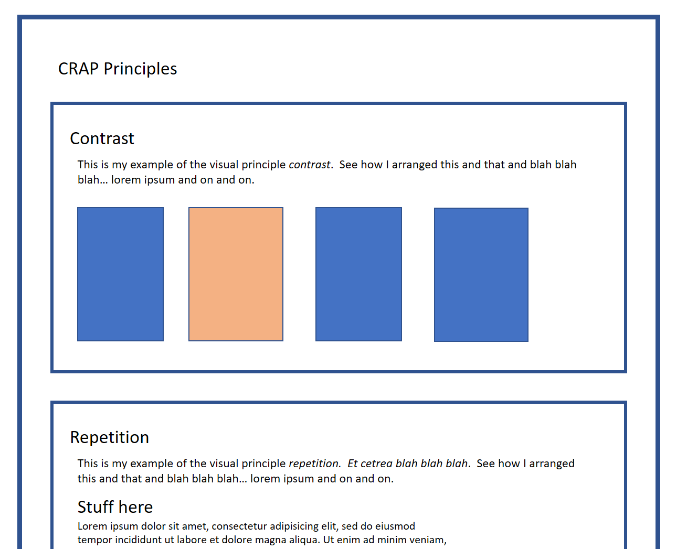

# In-class exercise 6: CRAP Principles

*Due: by the end of today's class, Wednesday, February 7, 2018* 

The goal of this exercise is to demonstrate each of the four basic principles of visual perception on a webpage.

- Contrast
- Repetition
- Alignment
- Proximity

You must choose how you demonstrate the principles using your own content.  

## Hints & Tips

Although the focus of this assignment is your understanding of the four visual principles of page design, one of the challenges here will be your ability to use CSS.  As you work, feel free to ask the TAs or the professor for help with your CSS.  

- Use the content you gathered for *in-class exercise 5: Information Architecture and Markdown*.  
- Do *not* just start dumping content into your HTML document and then start writing the CSS.  Start with a plan in mind.  Visualize - maybe sketch-out - what you plan to do *before* you start coding!  Look at examples on the web, then try to replicate the key parts so it's obvious on your web page what you're demonstrating.
- Plan to demonstrate each principle *separately*, i.e. make four sections.  Don't try and combine the demonstrations.  
- Feel free to Google things like "visual principles alignment" and other search terms to find descriptions and examples of each visual principle.
- As you work, think about the *meaning* of each principle.  For example, "contrast" (the easy one) is supposed to make things look different (contrasty) **when they are actually different!** So read the content!  Pick things that are supposed to be different because they are different, and then make them look different.  Get it?  And of course, things that are the same should not have contrast between them.
- You do not have to use all the content from exercise 5, just as much as you need to get the job done.
- Note: besides the styling to demonstrate the principles, you do *not* have to do any other styling or embellishments at all in this exercise.  I.e. just focus on styling the principles to make it clear that you understand them.  Leave the rest unstyled.  (The goal is to complete this assignment during the class time.)

## Add descriptions of what you're doing

- **Required:** add content (i.e. write it, yourself) words in the webpage that describe each principle you're demonstrating.  Explain in a sentence or two what you did and why. 
  - Write words that points the user (your grader!) to the thing(s) they need to look at to see (#1) the principle, and (#2) how you represented it in your webpage.
  - Make it really clear, even if you think it's obvious.

## Here's an example of what your webpage *might* look like

NOTE: there are many ways to demonstrate your understanding of each of the four principles.  This is just one type of layout you can use.  Just keep in mind, your examples must reflect the **meaning of the content** ...just don't style things!

## When you're done...

- Upload this assignment to the class web server (anywhere, really)
  - Note: use of a repository for this assignment is not required
- To get credit for your work, submit a link to your webpage in Blackboard, in the assignment: **In-class exercise 06: CRAP Principles**

